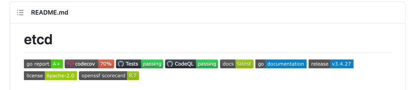
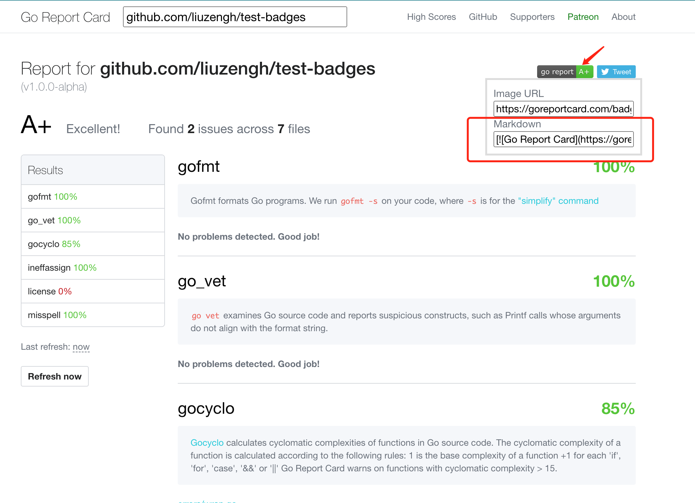

# test-badges
[](https://goreportcard.com/report/github.com/liuzengh/test-badges)

在 GitHub 仓库中，徽章（Badges）通常用于展示项目的各种状态和信息，例如代码质量、测试覆盖率、文档链接等。它们通常以图像的形式展示，并链接到相关的服务或页面。
例如 [etcd](https://github.com/etcd-io/etcd) 代码仓库中存在如下徽章:



本代码仓库展示如何为一个开源仓库添加各种徽章，本仓库的 errors 包的代码拷贝自 [go1.21.0 的 error 包](https://cs.opensource.google/go/go/+/refs/tags/go1.20:src/errors/)。

## Go Report

1. 在 https://goreportcard.com/ 页面上输入 module 名(`go get module@version`)，产生 report
2. 产生的 report 会出现在新的页面 https://goreportcard.com/report/github.com/liuzengh/test-badges 上，从该页面可以获取到对应的徽章：[](https://goreportcard.com/report/github.com/liuzengh/test-badges)


**注意：Go Report 网站是从 https://proxy.golang.org/ 获取代码的，如果代码没有缓存在 proxy.golang.org 上，则在执行第1步的时候，会出现以下错误:**

> There was an error processing your request: Could not analyze the repository: could not download repo: could not get latest module version from https://proxy.golang.org/test-badges/@latest: bad request: invalid escaped module path "test-badges": malformed module path "test-badges": missing dot in first path element

解决方法是根据 https://proxy.golang.org/ 上 FAQ：I committed a new change (or released a new version) to a repository, why isn't it showing up when I run go get -u or go list -m --versions? 来执行相关操作

> In order to improve our services' caching and serving latencies, new versions may not show up right away. 
> If you want new code to be immediately available in the mirror, then first make sure there is a semantically versioned tag for this revision in the underlying source repository.
> Then explicitly request that version via go get module@version. 
> The new version should be available within one minute.
> Note that if someone requested the version before the tag was pushed, it may take up to 30 minutes for the mirror's cache to expire and fresh data about the version to become available.

执行： `go get github.com/liuzengh/test-badges@v1.0.0-alpha`

```ascii
go: downloading github.com/liuzengh/test-badges v1.0.0-alpha
go: upgraded go 1.19 => 1.21
go: added toolchain go1.21.0
go: added github.com/liuzengh/test-badges v1.0.0-alpha
```